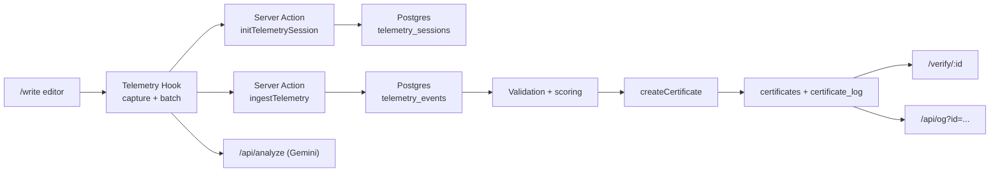

# Mindprint

Mindprint verifies *how* writing was created, not just the final text.

It captures behavioral telemetry (typing, pauses, revisions, paste patterns), computes a confidence/risk profile, and issues a signed, shareable certificate with replayable process evidence.

## Why Mindprint

Most tools try to detect AI from final text, which is brittle and easy to game.
Mindprint focuses on process provenance:

- Track human writing behavior in-session.
- Score behavioral authenticity from telemetry, not style heuristics.
- Issue cryptographically signed certificates.
- Verify records against a transparency log.

## Core Capabilities

- Live writing telemetry capture with Tiptap editor integration.
- Behavioral validation (`VERIFIED_HUMAN`, `SUSPICIOUS`, `LOW_EFFORT`, `INSUFFICIENT_DATA`).
- Signed telemetry sessions to prevent forged ingestion.
- AI-assisted session analysis endpoint (`/api/analyze`) using Gemini.
- Certificate issuance with immutable proof bundle + hash chaining.
- Verification page with trust checks and replay visualization.
- Trusted OG image generation only from persisted, verified certificates.

## Architecture



## Security Model

- Telemetry session tokens are signed server-side.
- Telemetry batches are sequence-checked and rejected if replayed or out-of-order.
- Certificate payloads are signed (`MINDPRINT_CERTIFICATE_SECRET`).
- Transparency log entries are hash-chained (`prevHash -> entryHash`).
- Verification recomputes digests/signatures and validates log linkage.
- OG image rendering only allows trusted, persisted certificate IDs.

## Tech Stack

- Next.js 16 (App Router), React 19, TypeScript
- Tiptap editor
- Drizzle ORM + Postgres
- Gemini (`@google/genai`) for optional analysis
- Tailwind CSS + Framer Motion

## Quick Start

### 1. Prerequisites

- Node.js 20+
- npm 10+
- Postgres 14+ (local or remote)

### 2. Install dependencies

```bash
npm install
```

### 3. Configure environment

Create `.env` from `.env.example` and update values.

```bash
cp .env.example .env
```

Recommended variables:

| Variable | Required | Purpose |
| --- | --- | --- |
| `DATABASE_URL` | Yes | Postgres connection for telemetry/certificates |
| `GOOGLE_API_KEY` | For analysis | Gemini API key for `/api/analyze` |
| `MINDPRINT_SIGNING_SECRET` | Production recommended | Base fallback signing key |
| `MINDPRINT_SESSION_SECRET` | Production recommended | Telemetry session signing key |
| `MINDPRINT_CERTIFICATE_SECRET` | Production recommended | Certificate proof signing key |
| `NEXT_PUBLIC_SUPABASE_URL` | No | Currently unused in core flow |
| `NEXT_PUBLIC_SUPABASE_ANON_KEY` | No | Currently unused in core flow |

### 4. Apply database schema

Choose one approach:

```bash
npm run db:push
```

or

```bash
npm run db:migrate
```

### 5. Run the app

```bash
npm run dev
```

Open [http://localhost:3000](http://localhost:3000).

## Typical Workflow

1. Go to `/write`.
2. Type naturally so telemetry can warm up.
3. Click `Analyze Session` (optional AI insight).
4. Click `Finish Session` to issue a certificate.
5. Open `/verify/<certificate-id>` to validate proof + replay.

## Available Scripts

| Command | Description |
| --- | --- |
| `npm run dev` | Start local development server |
| `npm run build` | Build production bundle |
| `npm run start` | Start production server |
| `npm run lint` | Run ESLint |
| `npm run db:generate` | Generate Drizzle migration artifacts |
| `npm run db:migrate` | Apply migrations |
| `npm run db:push` | Push schema directly to DB |
| `npm run db:studio` | Open Drizzle Studio |

## Project Layout

```text
src/
  app/
    write/              # Writing experience
    verify/[id]/        # Certificate verification page
    api/analyze/        # Gemini analysis endpoint
    api/og/             # Trusted OG certificate image
    actions/            # Server actions (telemetry, certificate)
  components/
    editor/             # Tiptap editor + PoH status
    certificate/        # Replay and certificate UI
  hooks/
    useMindprintTelemetry.ts
  lib/
    telemetry.ts        # Validation + risk scoring
    certificate-store.ts
    server-signing.ts   # HMAC signing/verification
  db/
    schema.ts
```

## Troubleshooting

### "Trusted telemetry session is still initializing"

- Ensure Postgres is reachable from `DATABASE_URL`.
- Ensure schema is applied (especially `telemetry_sessions` table).
- Retry from the editor telemetry status control.

### `503 model overloaded` from `/api/analyze`

- This is usually provider-side load.
- The API includes retry/backoff; try again after a few seconds.

### Build fails fetching Google Fonts

- `next/font` requires outbound network access at build time.
- In restricted environments, font fetch can fail even when app code is valid.

## ADRs and Context

- `docs/adr/001-use-drizzle-orm.md`
- `docs/adr/002-telemetry-ingestion-strategy.md`
- `docs/adr/003-postgres-for-json-logs.md`
- `docs/AI_CONTEXT.md`
